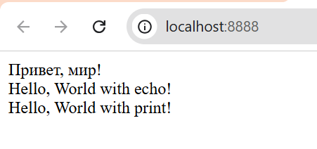

### Лабораторная работа №2

>- **Цель работы**
Целью данной лабораторной работы является установка и настройка среды разработки для работы с языком программирования PHP, а также создание первой программы на PHP.

**Написание первой PHP-программы:**

```php
<?php

echo "Привет, мир!";
```
Для начала создаю веб сервер PS C:\Users\Артём\OneDrive\Desktop\PHP_Lab2_Gherganov Artiom> php -S localhost:8888
После запуска программы во встроенном веб-сервере PHP мы наблюдаем, что строку успешно вывело:


**Вывод данных в PHP**

Вывожу строку "Hello, World!" используя функцию echo и print.

```php
echo "Hello, World with echo!";
print "Hello, World with print!";
```

В PHP echo и print используются для вывода текста


>`echo`

- Ничего не возвращает


>`print`

- Всегда возвращает 1



**Работа с переменными и выводом**

1. Создайте две переменные:
- Целочисленную переменную `$days` со значением 288.
- Строковую переменную $`message` с текстом: `Все возвращаются на работу!.`
2. Выведите значения переменных на экран несколькими способами:
- С использованием конкатенации. Конкатенация - это объединение строк, в PHP используется оператор .:
- С использованием двойных кавычек.
3. Используйте переход на новую строку в выводе используя тэг `<br />.`


### Контрольные вопросы

> Способы установки PHP:

- Встроенный сервер PHP — скачать PHP и запускать команду `php -S localhost:8888.(например)`

- XAMPP / WAMP / MAMP — пакеты с Apache и MySQL, ставишь и готово.

- Через пакетный менеджер .

> Как проверить, что PHP установлен и работает:

 - В терминале: `php -v `— покажет версию PHP.

- В браузере: создать файл `index.php` с кодом  — откроется страница с настройками PHP.

> Чем отличается оператор `echo` от `print`:

- `echo` может выводить несколько значений, ничего не возвращает, немного быстрее.
- `print` выводит только одно значение, возвращает 1, можно использовать в выражениях.
